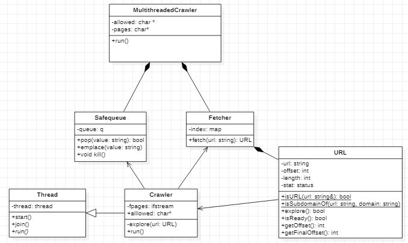

# TP2 - Web Crawler

Pablo Salvador Dimartino - 101231

Taller de Programación I (75.42) - 1º Cuatrimestre 2021

Facultad de Ingeniería

Universidad de Buenos Aires

[Link al repositorio de GitHub](https://github.com/psdimartino/TallerDeProgramacion_TP2)

## Introduccion

Para la resolución del problema planteado se decidió orientar la estructura del código para:
1. Minimizar la cantidad de movimientos de objetos: Dicha acción es costosa en recursos del procesador
2. Mantener un seguimiento claro de que clase es responsable de un objeto dado, facilitando asi la liberación de los recursos de forma correcta.
3. Minimizar la cantidad de estructuras de datos evitando que existan demasiados recursos compartidos con diversas secciones criticas.

## Estructura general

La clase principal `MultithreadedCrawler` contiene a los recursos compartidos y es la responsable de iniciar los threads y finalizarlos luego del tiempo establecido.

La relacion entre las clases se puede observar en el siguiente diagrama:

### Threads

Los distintos *Threads* que se inician son el metodo `start()` perteneciente a la clase `Crawler`. Dicha clase es la responsable de la orquestación de los recursos para realizar el proceso principal del programa: el fetch y escaneo de las paginas y la carga de las `URL`s que contienen a la cola.

### Recursos compartidos

Existen dos recursos que son compartidos por todos los threads:

1. `targets`: Cola bloqueante que se encarga de contener los URLs (`strings`) a ser procesadas

2. `fetcher`: Clase responsable de contener el indice de todas las paginas. Dicho indice es cargado inicialmente con las ``URL``s (clase URL) del archivo *index*, seteando su estado en READY. Al realizar un fetch, dicha clase busca en el indice. De contener la URl la devuelve. En el caso de no contenerla, la crea en estado DEAD y la devuelve.

Se decidio crear un `ifstream` del archivo *pages* dentro de cada hilo, evitando asi *race conditions* en la lectura.

## Secciones criticas

Existen 5 secciones criticas en 3 clases distintas:

### ``SafeQueue``:

* El método ``pop()`` requiere que desde el check ``q.empty()`` y el ``pop()`` no se realizen otras operaciones que podrian invalidar el check.
* El método ``emplace()`` requiere compartir el mismo mutex que el metodo ``pop()`` ya que no se asegura que la implementacion de la librería estandar *queue* sea thread safe.

* El booleano ``isAlive`` es atómico para evitar la *race condition* al modificar o leer su valor.

### ``Fetcher``:
* Existe una critical section en el metodo fetch: Es importante que entre el check de la existencia de la entrada del mapa *index* y la inserción de una nueva URL no se realize la misma operacion en otro thread. Esto evita que se cargue la misma URL dos veces

### ``URL``:
* El metodo ``explore()`` esta protegido. Esto es necesario ya que una URL solo es procesada si esta en estado READY. Si dos threads hacen una lectura simultanea del estado, dicha ``URL`` se procesaría dos veces.

## Responsabilidad y movimiento de objetos

Se evito el movimiento de las URLs ya que el `Fetcher` es el unico objeto que contiene a las instancias de estas. El método `fetch()` devuelve una referencia a la URL para que el crawler la pueda modificar.

La creación de la URL se hace directamente dentro del mapa *index* evitando el movimiento.

El único movimiento de objetos se hace en el método ``pop()`` y al llamar a ``emplace()`` de la clase ``SafeQueue``

Siendo que por enunciado *"Todas las clases implementadas deben ser movibles y no-copiables"* se implementaron los constructores por movimiento y asignación por movimiento de todas las clases, aunque no se utilizen.

Ambos operadores hacen el check ``if (this == &other)``. En el caso de la sobrecarga del operador asignación, la acción *move* dejaría en un estado invalido el atributo movido. En el caso del constructor por movimiento, se evita un error en el caso ``Foo a = std::move(a)``, el cual utilizaria una variable no inicializada.

## Fuente

Se utilizo el codigo de la clase Threads del [github](https://github.com/Taller-de-Programacion/threads/blob/master/tutorial-interactivo/03_is_prime_parallel_by_inheritance.cpp) de la materia Taller de Programación I 
